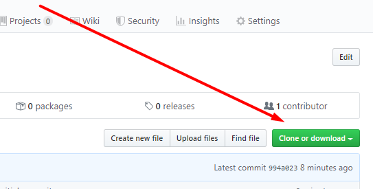
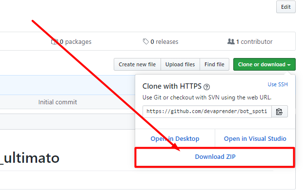

# Bem vindo ao repositório da [Dev Aprender](https://www.devaprender.com)!

Descubra como o poder da programação pode **mudar seu o futuro** e a **sua vida!**

Redes Sociais:
* [Youtube](https://www.youtube.com/devaprender.com)
* [Site](www.devaprender.com)
* [Instagram](https://www.instagram.com/devaprender.official/)
* [Facebook](facebook.com/devaprender/)

---

# Imagine se você pudesse:

* **Criar robôs** que trabalham por você?
* **Usar** a programação ao seu favor?
* **Economizar** dezenas de horas?
* **Monetizar** seu conhecimento?

Vou te ensinar tudo isso [neste curso](http://b.link/GitHub_curso_automacao), saiba mais [clicando aqui](http://b.link/GitHub_curso_automacao).

---
# Repositório baseado em [vídeo no canal](https://www.youtube.com/watch?v=HZr6PSTLoOw&feature=youtu.be)
# Instruções de como usar esses arquivos:

 - Se já usou o github antes já deve saber como fazer o download deste arquivo.
 - Se você nunca usou o GitHub(este site) antes, veja o que fazer abaixo

# Como baixar os arquivos

1. Clique no botão verde para fazer o download

    

2. Clique em Download ZIP

    
